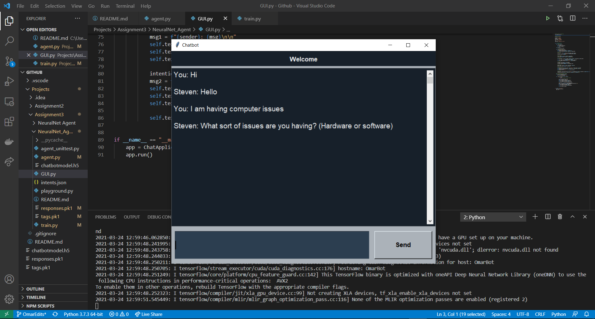
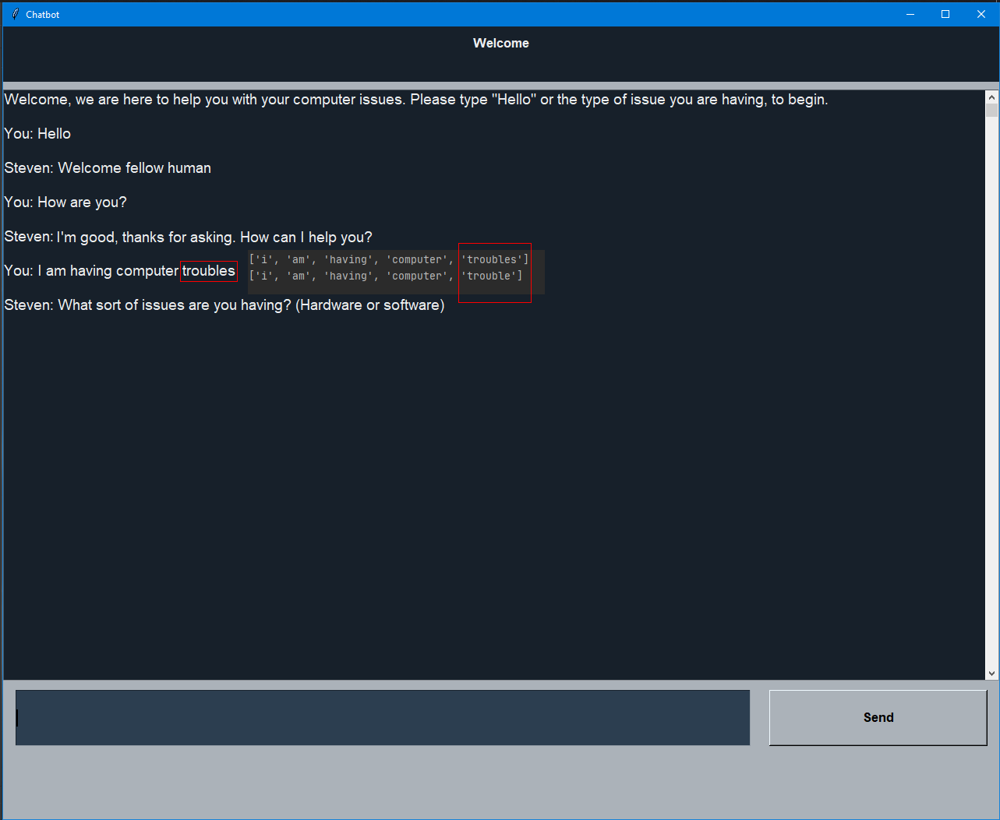
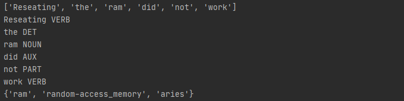
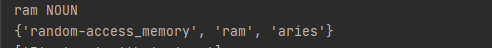
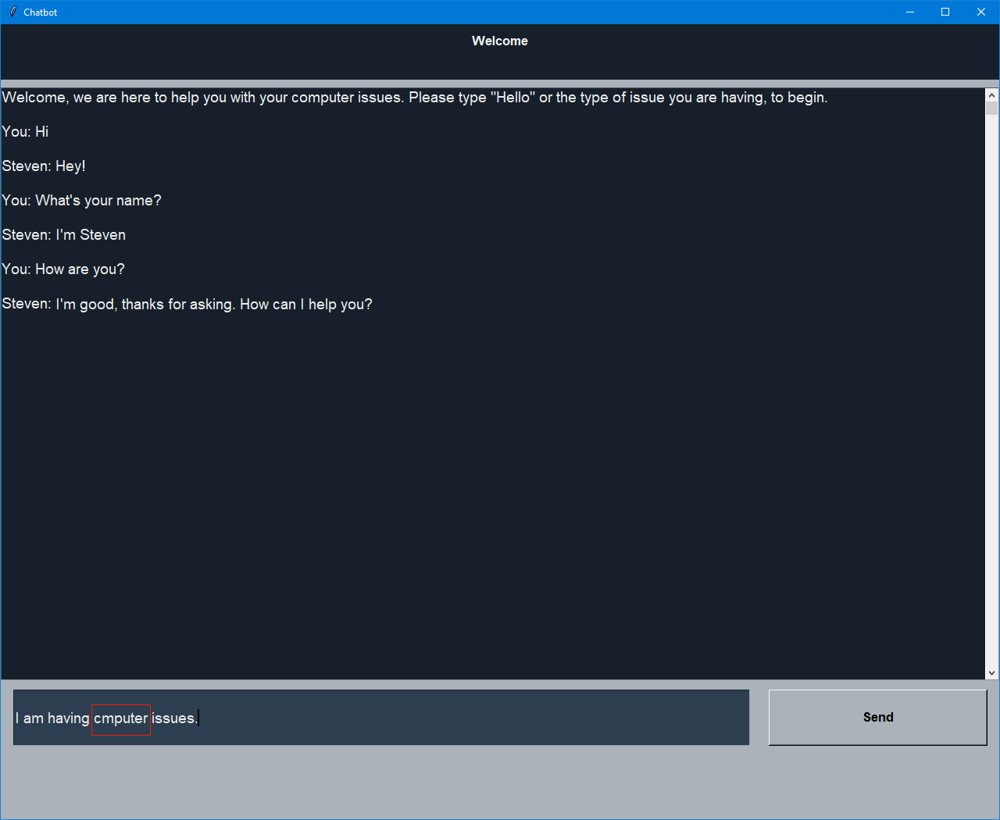
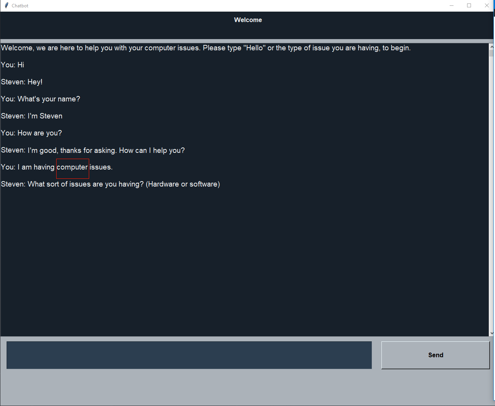
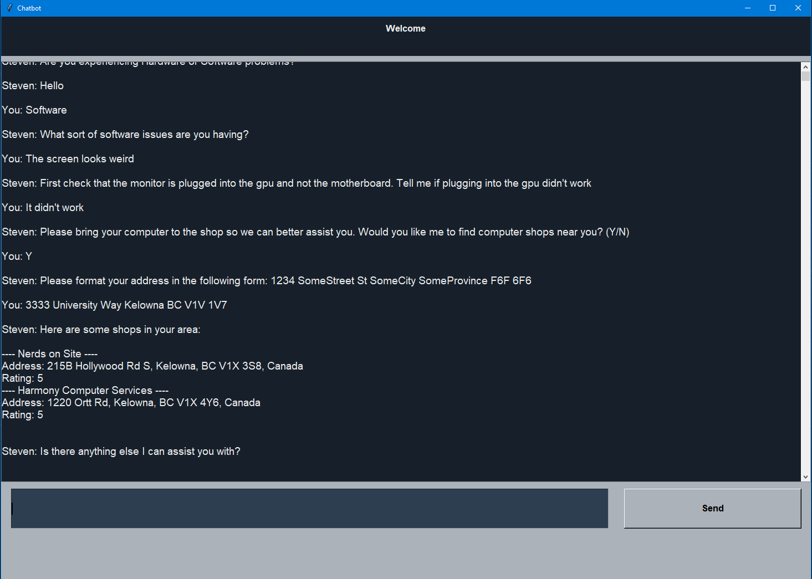

# Individual Assignment (Continuation of group Project 3)
Computer science 310 Team 7

This project is on a conversational agent that takes word or sentence input from a user and outputs an appropriate response. Our specific conversational agent is a computer tech support agent that answers hardware and software related issues. The program was written in Python.

The Neural Net uses a JSON file as a database and each entry contains a tag (the conversation category), a list of patterns (individually typed messages on what the user is likely to type), and a list of random responses the agent will pick at random to use. Training the Neural Net takes this data from the JSON and essentially matches the tags to the patterns and responses, it deconstructs the patterns into bags of words to match with inputs later, and it stores all this in a binary file for fast easy execution of the program. The Neural Net has a more sophisticated portion where it finds consistently appearing unique words in the patterns of a tag and it assigns a higher probability to this tag if an input matches with this unique word.  

The bags of words was enhanced to increase the probability of matching with the expected intention. Stemming & lemmatization attempts to find the base or dictionary form of a word. It does simple stuff of stemming a word from 'cars' to 'car' and it also uses the proper vocabulary of a word to convert it from 'am, are, is' to 'be' using lemmatization. The purpose is to reduce the vocabulary of the model and attempt to find the more general meaning behind sentences. This is implemented using the NLTK.

Another enhancement done to the bag of words was using part of speech (pos) tagging to find nouns and adjectives in the bag of words then finding synonyms of these words to add to the bag. This addition improves upon the basic patterns and sentence structure of the original intention and enhances it with an increased vocabulary. The original implementation recognized 'computer problems' as an input but the new implementation finds the synonym of 'problems' as 'issues' and now recognizes 'computer issues' as an input. This is implemented using the NLTK and spaCy natural language processing.

When using the Neural Net, it gets some input from the user, converts the input into a bag of words and rids of uppercases and punctuation, compares the bag of input words to the bags of patterns, finds patterns with the most word matches and gets the most probable tag, then it picks a response from the list in the tag. 

## Setting up Neural Net Agent
* Clone 'Assignment3' onto PC  
* Open the 'NeuralNet_Agent' folder in a Python IDE  
* In terminal enter: 
  > ```pip install nltk```  
  > ```pip install tensorflow```  
  > ```pip install pandas```  
  > ```pip install numpy```  
  > ```pip install pickle```  
  > ```pip install -U spacy```  
  > ```pip install -U googlemaps```
  > ```python -m spacy download en_core_web_sm```
* In python terminal enter
  > ```import nltk```  
  > ```nltk.download()```  
  > ```nltk.download('wordnet')```  
  > ```nltk.download('punkt')```
## Agent Class
The Agent class is located in the agent.py file. The Agent class has the following structure:
* Attributes:
  * ```lemmatizer (object): A wordnet lemmatizer object```
  * ```intents (object): A JSON object containing all the structure of the neural net model.```
  * ```tags (list): A list containing all the response type tags from a pickle object.```
  * ```responses (list): A list containing all the responses from a pickle object.```
  * ```model (object): An object containing a trained model.```
  * ```check (method): A method that autocorrects spelling mistakes```
* Methods:
  * ```spellCheck(): takes a sentence and corrects any spelling mistakes based on closest known word```
  * ```deconstructSentence(): deconstructs sentences into their root words.```
  * ```bagWords(): uses the deconstructed sentence to a series of words and maps it to a matching tag.```
  * ```predictResponse(): uses the chatbot model to return a response, with an associated probability.```
  * ```getResponse(): returns random bot response that has a greater probability than the minimum threshold.```
  * ```findShop(): check if the bot's response has exhausted all possible solutions and offer to locate a repair shop in the area```
  * ```run(): runs the chatbot.```
## Model Class
The Model class is located in the train.py file. The Agent class has the following structure:
* Attributes:
  * ```lemmatizer (object): A wordnet lemmatizer object.```
  * ```intents (object): A JSON object containing all the structure of the neural net model.```
  * ```tags (list): A list containing all the response type tags from the intents object.```
  * ```responses (list): A list containing all the responses from the intents object.```
  * ```patterns (list): A list containing a sample of user inputs for a particular tag from the intents object.```
* Methods:
  * ```synonym(str): adds to each pattern the synonyms of nouns and adjectives.```
  * ```train(): trains the bot using a Neural net.```
### Note: Make sure you are using a version of python 3.8, python 3.9 has compatibility issues.

## ChatApplication Class (GUI)
The ChatApplication class is located in the GUI.py file. **Note:** this python class utilizes the `tkinter` python package. This class has the following structure:
* Attributes:
  * ```window (object): A window object that holds the user interface.```
  * ```agent (object): An object that references the agent class as an object.```
  * ```cases (object): Helps the bot navigate the special case to find a local computer repair shop```
* Methods:
  * ```run(): runs the chatbot in the GUI window mainloop.```
  * ```_setup_main_window(): A function of the window object that provides a title, window size and other features.```
  * ```_on_enter_pressed(): calls _insert_message function whenever user presses the enter button after typing a message. Additionally this method now checks if the user has consented to find the nearest computer repair shop, if so it will find shops near the address specified by the user (if the shop has a user rating equal to 5)```
  * ```_insert_message(): takes a message and a sender as a parameter and inputs messages into the main message box. Note: calls on methods within agent.py as well.```
  * ```_bot_response(): takes a user's input and uses the agent.py method predictResponse() and getResponse() methods to retrieve the chatbot's response.```
  * ```_need_help(): takes in userInput to check if the user consented to lookup computer repair shops in the area otherwise return to check if the user requires any more assistance```

## googleAPI Class
The google API class is located in the API.py file. This class makes use of the Places and Geocode APIs. This class has the following structure:
* Attributes:
  * ```credentials (object): Contains the necessary API key to enable usage of the two APIs```
* Methods:
  * ```placesSearch(): takes in a google maps client, search term and keyword argument. It passes the search term and client to the Places API, and then returns a JSON (this JSON is saved to a text file for easier access) of locations that are near the area that matched the parameters givent to it.```
  * ```addressLookup(): takes in a string address of the form: 1234 SomeStreet St SomeCity SomeProvince F6F 6F6 and passes it to the Geocode API. Then a JSON of information including the longitude and latitude for that address is returned.```
  * ```shopSearch(): takes in a street address and the search term 'computer repair' and searches for shops that match that description near the specified location. It makes use of both placesSearch() and addressLookup().```

## Compile training data for the chatbot
* Compile train.py (Only have to do this once, unless changes are made to the intents.json)
* **Note**: Do not be concerned with errors thrown in command console, there are some issues with the tensorflow library that do not affect the chatbot.

## Running chatbot
* Compile 'GUI.py'
* **Note**: Do not be concerned with errors thrown in command console, there are some issues with the tensorflow library that do not affect the chatbot.

## List of Files
* **agent.py** *Runs the conversation agent program and takes in inputs to speak to it*
* **API.py** *Controls the use of Geocoding and Places API*
* **unittest.py** *Runs a unit test on the Agent class*
* **train.py** *Compiles the data from the intents.json*
* **playground.py** *Test file for visualizing functionality of POS tagging and synonym recognition*
* **intents.json** *Database that stores tags, corresponding patterns, corresponding responses*
* **placesSearch.json** *Stores data about locations that are found near a queried address*
* **tags.pk1** *Stores the character stream of tags to be reconstructed later for the agent script*
* **responses.pk1** *Stores the character stream of responses to be reconstructed later for the agent script*
* **chatbotmodel.h5** *Trains the tags to have higher probabilities for certain words that consistently appear in its patterns and stores this information as a hierarchical data structure*
* **playgrounds.py** Tests how POS tagging and synonyms can be used in conjunction
* **GUI.py** Compiles the GUI for the chat bot
##  Imports 
* Random
* JSON 
* Pickle
* NumPy
* NLTK
  * Stem
  * Corpus
* TensorFlow
* spacy
* autocorrect
* unittest
* googlemaps

## List of features
Each features that will be mentioned below will include a rationale as to why it has been chosen and a snippet of the feature in action.

### GUI
Simple GUI developed to run the program where user can view converstation history. This allows for a cleaner interaction.



### Stemming & Lemmatization
Stemming & lemmatization attempts to find the base or dictionary form of a word. It does simple stuff of stemming a word from 'cars' to 'car' and it also uses the proper vocabulary of a word to convert it from 'am, are, is' to 'be' using lemmatization. The purpose is to reduce the vocabulary of the model and attempt to find the more general meaning behind sentences of the model and the input.



### POS Tagging
Parts of speech (POS) tagging uses AI to recognize a sentence structure and correctly label the pronouns, nouns, verbs, adjectives etc., of each word in a sentence. It was analyzed that replacing nouns and adjectives in a sentence with synonymous words still portrayed the correct sentence structure and intention. POS tagging was used to find and single out these words that were given to the model.



### Synonym Recognition
Synonym recognition can gather a list of synonyms of a word depending on its intention as a verb, noun, adjective, etc. The nouns and adjectives found using POS tagging were used to get a list of their respective noun or adjective synonyms. It can recognize the noun of 'problems' in 'computer problems' and get the synonym as 'issues' and add it the the recognized input of that intention. This addition improves upon the basic patterns and sentence structure of the original recognized input pattern and enhances it with an increased vocabulary. 



### Autocorrect
Spell checking was implemented through the Autocorrect package. The implementation is a function that takes the sentence the user inputs and checks the spelling of each word against the english dictionary. If any mistakes are detected it will attempt to identify the closest word to the incorrectly spelled one.





### Geocode and Places API
The Geocode API accepts a user specified address through the GUI.py. It then determines the longitude and latitude coordinates of that address. Next the Places API can find locations that match the search terms and are near the coordinates provided by the Goecoding API. This information is saved to a JSON, then parsed by GUI.py, filtered by rating and returned in a readable format for the user.

